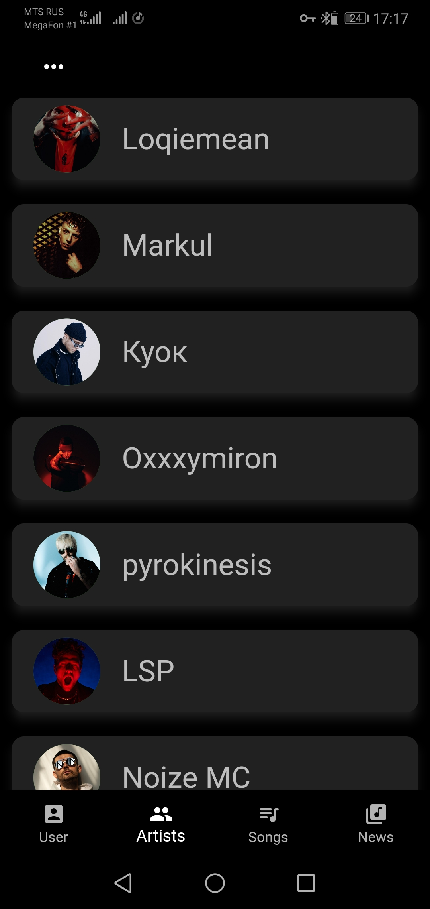
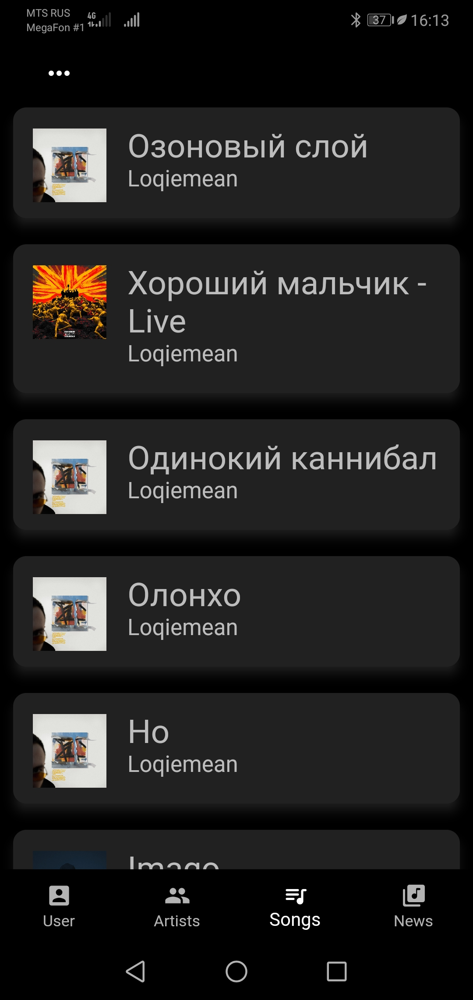
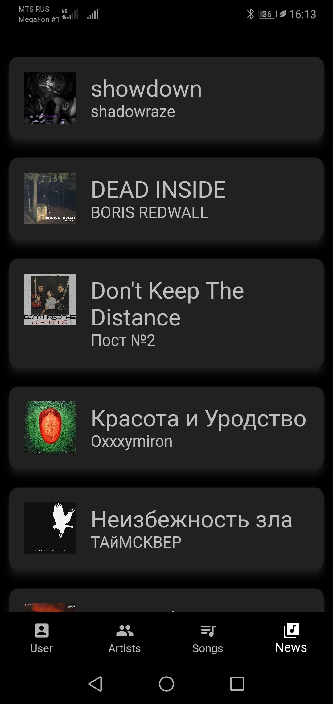
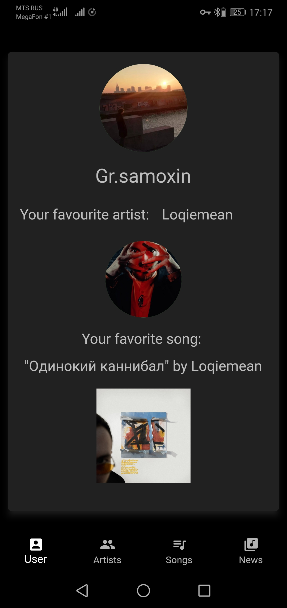

# Spotibud

The development of the application has been stopped for an indefinite period due to the lack of access to Spotify in Russia. The goal of the project is to write an application on the Android platform using Dart+Flutter. The application provides information using the Spotify API.

Command porject with Bushmanov Nicholas (Jurv1)

<b> Current features:</b> 
<ul>
<li><b>Top 10 of Artists: </b> 
A page with the top 10 of artists of from the selected time period (month, half a year, all the time).
<li><b>Top 10 of Songs: </b> 
A page with a top 10 of songs from the selected time period (month, half a year, all the time).
<li><b>Last news of favovourite artists: </b> 
A page that displays the latest news of the user's favorite artists.
<li><b>User page: </b>  
The user's page showing the most listened artist and the most listened song.
</ul>

 

# Resources
<b>This project uses resources:</b>
<ul>
<li>IMDb API documentation - https://developer.spotify.com/</li>
<li>TaskBoard - https://trello.com/b/GAB23OP6/team-7 </li>
</ul>